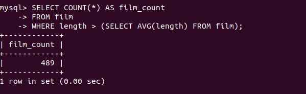

# Домашнее задание к занятию "`SQL_part2`" - `NikonovDA`


### Задание 1

```
Одним запросом получите информацию о магазине, в котором обслуживается более 300 покупателей, и выведите в результат следующую информацию: 
 
1. фамилия и имя сотрудника из этого магазина; 
2. город нахождения магазина; 
3. количество пользователей, закреплённых в этом магазине.
```


### Задание 2

```
Получите количество фильмов, продолжительность которых больше средней продолжительности всех фильмов.
```




### Задание 3

```
Получите информацию, за какой месяц была получена наибольшая сумма платежей, и добавьте информацию по количеству аренд за этот месяц.
```


